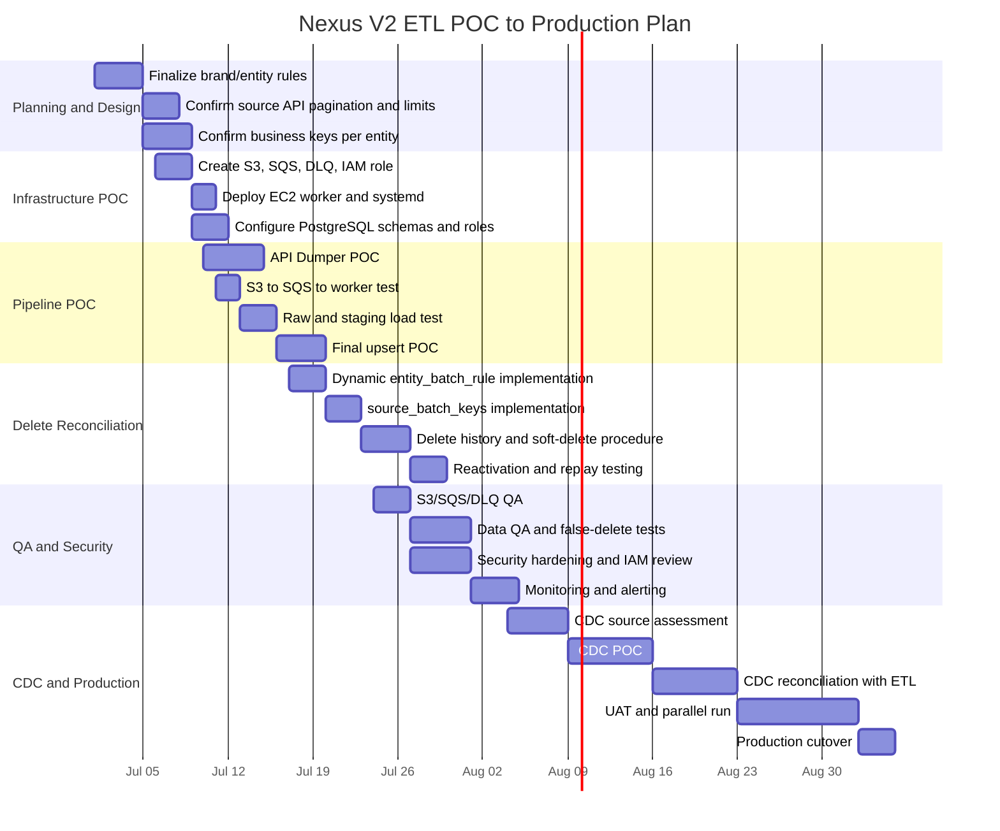

# Nexus V2 POC, Testing, CDC, and Production Timeline

## Direct answer

A realistic timeline without major loopholes is:

| Track | Estimated Duration |
|---|---:|
| POC only | 2 to 3 weeks |
| Hardened UAT-ready version | 4 to 6 weeks |
| Production-ready with security, monitoring, delete reconciliation, replay, and rollback | 8 to 12 weeks |
| Production-ready including CDC/database replication integration | 10 to 16 weeks |

The timeline depends mostly on provider API behavior, final table complexity, CDC source access, and how many brands/entities must be onboarded in the first release.

## Plain-English justification

The S3/SQS/EC2 part is not the longest part.

The longer work is making sure the data rules are correct:

- which date field per brand/entity,
- what business key identifies each record,
- how to detect source deletes safely,
- how to avoid false deletes,
- how to replay failed batches,
- how to secure IAM, database, EC2, and secrets,
- how to validate CDC/replication without duplicate or orphan records.

## Gantt chart - POC and production plan

## Phase-by-phase estimate

### Phase 1 - POC foundation: 2 to 3 weeks

Deliverables:

- S3 bucket
- SQS queue
- DLQ
- EC2 worker
- raw load
- staging load
- sample final upsert
- one brand/entity POC
- basic delete-before-insert test

### Phase 2 - Hardened pipeline: 4 to 6 weeks

Deliverables:

- dynamic `etl.entity_batch_rule`
- rolling 3-day lookback
- source-delete history
- soft-delete final rows
- reactivation
- backfill/replay
- DLQ handling
- audit tables
- operational logs

### Phase 3 - Production readiness: 8 to 12 weeks

Deliverables:

- IAM least privilege
- database role hardening
- secret management
- CloudWatch alerts
- CloudTrail
- failure runbook
- UAT data validation
- performance tests
- retention policy
- disaster recovery procedure

### Phase 4 - CDC/replication included: 10 to 16 weeks

Deliverables:

- CDC source assessment
- CDC tool selection
- CDC POC
- CDC-to-ETL merge rules
- duplicate handling between API pull and CDC
- replay strategy
- reconciliation report
- production parallel run

## Recommended project answer for management

For a safe production-grade implementation, the realistic estimate is 8 to 12 weeks for the ETL pipeline, including security, monitoring, delete reconciliation, replay, and production readiness.

If CDC/database replication is included, the safer estimate is 10 to 16 weeks because CDC requires additional source access, replication permissions, validation, and duplicate-prevention rules.
